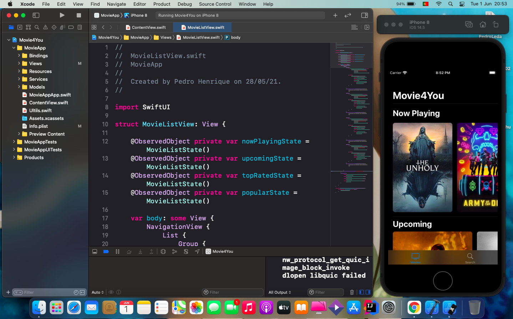
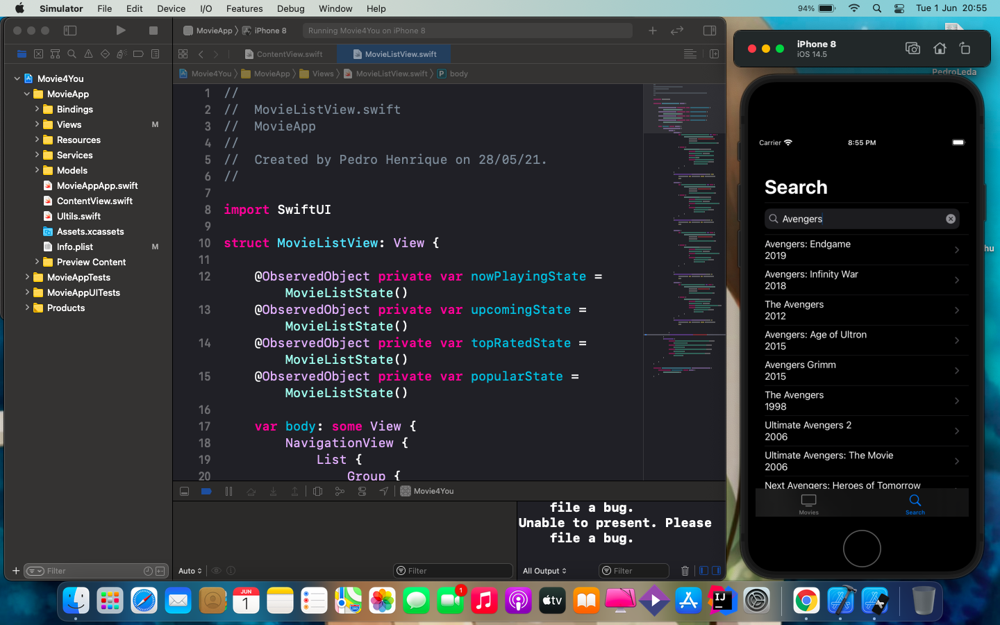
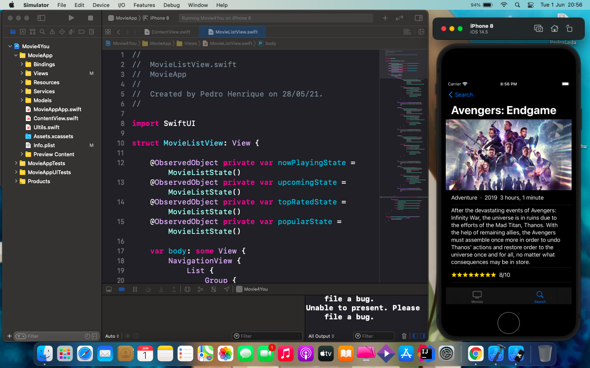
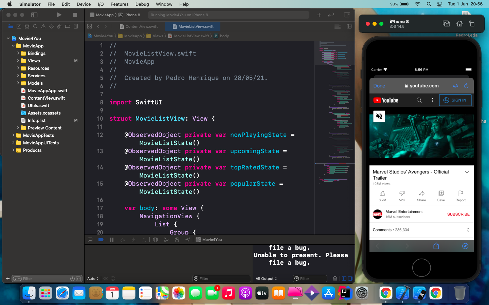

# Movie4You

## 📋 Descrição

Nesse repositório está o projeto que desenvolvi para aprender e fixar os conhecimentos em Swift. 

O Movie4You é um projeto feito para dispositivos IOS, como parte do teste tecnico da empresa [Mobile2you](https://www.mobile2you.com.br/pt/) com algumas adaptações.

Consiste em um app que é basicamente um catalogo de filmes que consome a api do [TMDB](https://www.themoviedb.org/), onde são exibidos filmes por categorias como: Em breve (proximos lançamemtos) ou Mais assistidos no momento.

=)

## 📲 ScreenShots

### Tela inicial

### Tela Busca

### Tela com o filme selecionado

### Tela com os trailers disponiveis para assistir

### Tela com o trailer selecionado

- OBS: Dispositivo do screnshoot estava em modo Dark.

## 🖥️ Tecnologias

- Swift
- SwiftUI

## 🎨 Projeto
*✓ Finalizado (sujeito a melhorias)*

##  📩 Avisos
*O Projeto contem a minha chave de api, caso queira executar o projeto com sua propria chave da api, basta ir no site do  [TMDB](https://www.themoviedb.org/), fazer o cadastro e gerar sua propria chave, em seguida vá no projeto e adicione a sua chave como valor da variavel "apiKey" que fica dentro do arquivo MovieStore.swift.*
